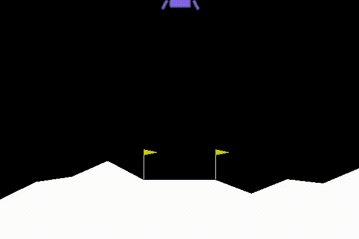

# DQN

Implement deep Q network [1] and double DQN [2].

Play game with random selected actions

A trained agent is playing the game

=======

Training tips:
* Huber loss is more efficient than MSE loss.

## References
[1] V.  Mnih,  K.  Kavukcuoglu,  D.  Silver,  A.  Graves,  I.  Antonoglou,  D.  Wierstra,  and  M.  Riedmiller.Playing atari with deep reinforcement learning.arXiv preprint arXiv:1312.5602, 2013.

[2] H. Van Hasselt,  A. Guez,  and D. Silver.  Deep reinforcement learning with double q-learning.  InThirtieth AAAI conference on artificial intelligence, 2016.
