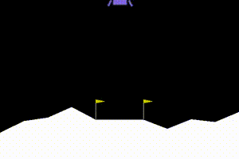

# DQN



This code implemented deep Q network [1] and double DQN [2].

### Instructions
* `buffer.py` stores transitions collected at each step and reuse them for training
* `model.py` defines the network architecture
* `agent.py` defines (double) DQN agent

Option 1: watch a trained agent
```python
python3 watch.py
```
Option 2: follow the instructions in `notebook/solve_LunarLander.ipynb` to train your agent

### Implement Details
The two key elements in DQN algorithm are: replay buffer and target network. The former decorrelates the experience tuples and the latter solves the moving target problem.

In DQN algorithm, the next action used for evaluating the target Q value is chosen from the target network. This manner, however, is believed to result in overestimation. In double DQN algorithm, the next action is chosen from the online network, so the noise in selecting action and evaluating value is decorrelated.


### Tips:
* Huber loss is more efficient than MSE loss.

## References
[1] V.  Mnih,  K.  Kavukcuoglu,  D.  Silver,  A.  Graves,  I.  Antonoglou,  D.  Wierstra,  and  M.  Riedmiller.Playing atari with deep reinforcement learning.arXiv preprint arXiv:1312.5602, 2013.

[2] H. Van Hasselt,  A. Guez,  and D. Silver.  Deep reinforcement learning with double q-learning.  InThirtieth AAAI conference on artificial intelligence, 2016.
