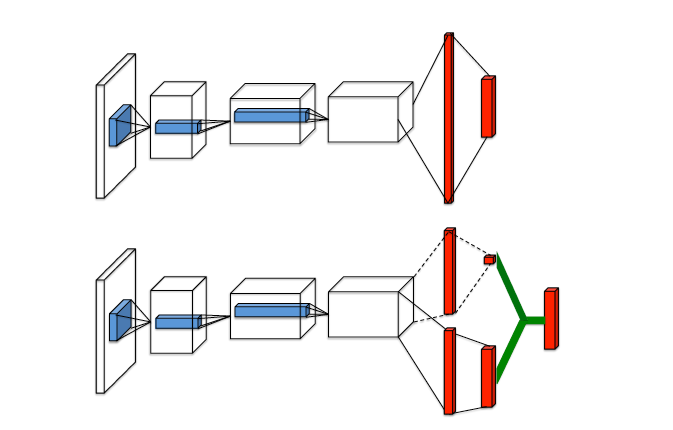
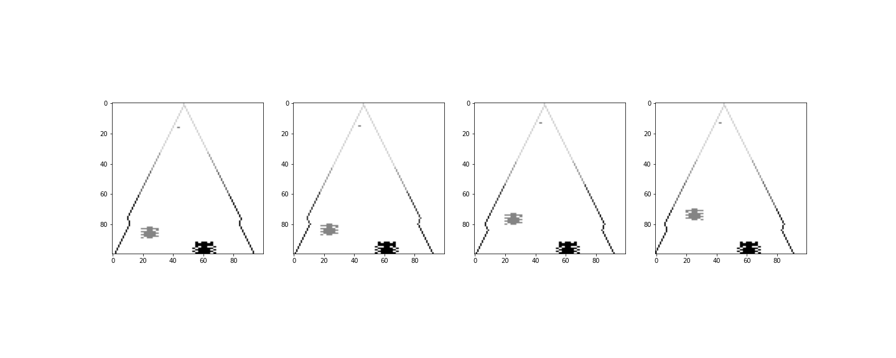

# Dueling DDQN

This code implemented dueling network architecture [1].



Test environment: `Enduro-v0`
- observation space: `Box(210, 160, 3)`
- action space: `Discrete(9)`

Select actions randomly:


A trained agent (dueling DDQN) is playing the game:


### Instructions
- option 1: play with the trained agent
```python
python3 watch_agent.py
```
- option 2: follow the instructions in `test_train.ipynb` to get started with training your own agent.
  - set hyperparameters:
    - BUFFER_SIZE = int(1e6)  # replay buffer size
    - BATCH_SIZE = 64         # minibatch size
    - GAMMA = 0.99            # discount factor
    - TAU = 1e-3             # for soft update of target parameters
    - LR = 5e-4               # learning rate
  - expected outputs:
    - network weights: `cpu_checkpoint.pth`

### Implement Details
In `Enduro-v0` environment, the observation is an RGB image of the screen, which is an array of shape `(210, 160, 3)`. The preprocess step turns each RGB image into a grey frame with shape `(1, 100, 100)`. Each action is repeatedly performed for `4` time steps and corresponding four frames are stacked together as one input state. By doing this, time-dependent features (e.g. speed, direction, etc.) can be captured.



Dueling network architecture represents two separate estimators: one for the state value function, and one for the advantage function.

```python
class duelingNet(nn.Module):
    def __init__(self, action_dim, channel_dim = 4):
        super(duelingNet, self).__init__()
        self.features = nn.Sequential(
            nn.Conv2d(channel_dim, 32, kernel_size=8, stride=4, bias=False),
            nn.ReLU(),
            nn.Conv2d(32, 64, kernel_size=4, stride=2),
            nn.ReLU(),
            nn.Conv2d(64, 64, kernel_size=3, stride=1),
            nn.ReLU(),
            nn.Flatten()
        )

        self.value_layer = nn.Sequential(
            nn.Linear(5184, 512),
            nn.ReLU(),
            nn.Linear(512,1)
        )

        self.adv_layer = nn.Sequential(
            nn.Linear(5184, 512),
            nn.ReLU(),
            nn.Linear(512,action_dim)
        )

    def forward(self, state):
        x = self.features(state)
        v,a = self.value_layer(x), self.adv_layer(x)
        return  v - a + a.mean(dim=1).unsqueeze(1)
```


## References
[1] Z. Wang, T. Schaul, M. Hessel, H. Van Hasselt, M. Lanctot, and N. De Freitas.  Dueling network architectures for deep reinforcement learning.arXiv preprint arXiv:1511.06581, 2015.
