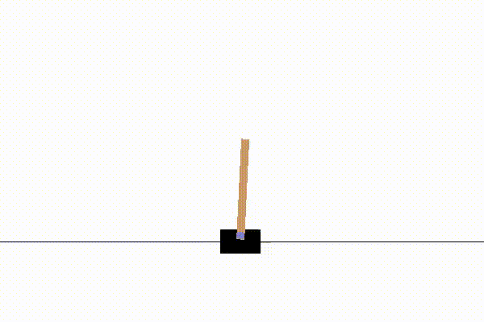
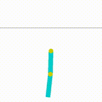
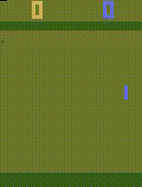

# DRLexercises

Implement multiple deep RL algorithms:
- REINFORCE

trained agent plays `CartPole-v0`

trained agent plays `Acrobot-v1`

- PPO

trained agent plays `PongDeterministic-v4`

- DQN

play `LunarLander-v2`

- DDQN

play `LunarLander-v2`

play `Enduro-v0`

- Dueling DDQN

trained agent plays `Enduro-v0`

- Prioritized DDQN (Prioritized experience replay + DDQN)

- DDPG

- D4PG

- A2C
