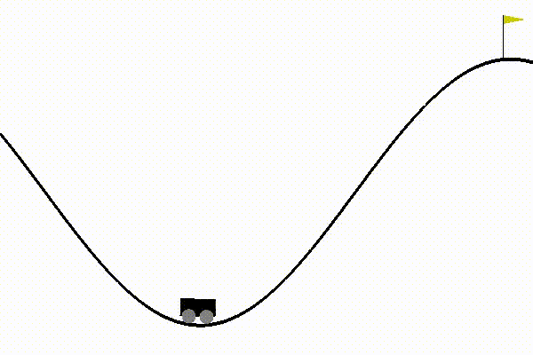

# DRLexercises

Implement multiple deep RL algorithms:

* REINFORCE
* PPO
* A2C: in progress
* DQN: implement Deep Q network and double DQN algorithms
* perDQN: implement Prioritized experience replay + double DQN
* DuelingNet
* NoisyNet: in progress
* DDPG: in progress
* MADDPG: in progress
* TEST
