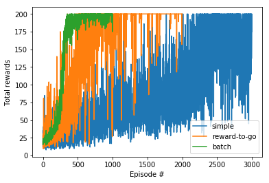
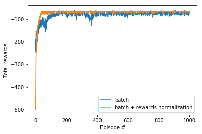

# REINDORCE

Implement 1: `noise_reduction_1.ipynb`
- simple REINFORCE algorithm
- reduce noise by using reward-to-go
- reduce noise by using batch

Trained agent plays `CartPole-v0`

Implement 1: `noise_reduction_2.ipynb`
- use parallel environment to collect batch
- add reward normalization within a batch

Trained agent plays `Acrobot-v1`

